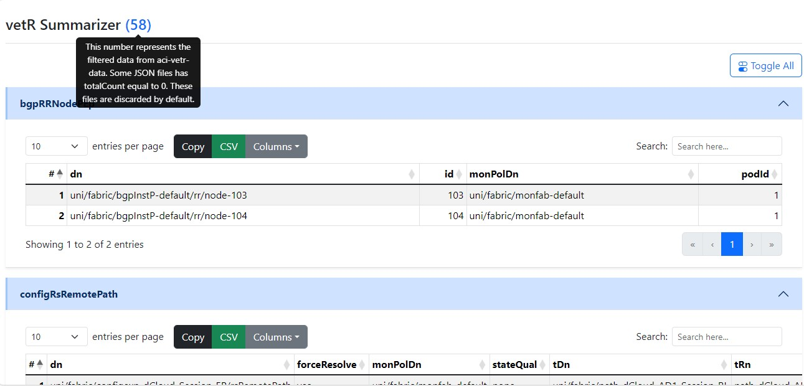

[](https://developer.cisco.com/codeexchange/github/repo/Tes3awy/vetr-summarizer)

[](https://github.com/psf/black)
[](https://pycqa.github.io/isort/)


[](https://saythanks.io/to/Tes3awy)

## Table of Contents

1. [vetR Summarizer](#vetr-summarizer)
2. [Objective](#objective)
3. [How it Works](#how-it-works)
4. [Installation](#installation)
5. [Usage](#usage)
6. [Use Case](#use-case)


## vetR Summarizer

This tool summarizes data from any APIC collected by [vetr-collector](https://github.com/brightpuddle/vetr-collector).

## Objective

This tool processes data collected by [vetr-collector](https://github.com/brightpuddle/vetr-collector) for the ACI health check and displays it in a pretty HTML tabluar format. This tool can also be run from any computer having `aci-vetr-data` collected from any APIC.

The `aci-vetr-data` directory you get from `vetr-collector v3.3.0` includes **91** raw JSON files.

```bash
$ ls aci-vetr-data
apPlugin.json
bgpRRNodePEp.json
configRsRemotePath.json
coopPol.json
ctxClassCnt.json
datetimeNtpProv.json
datetimePol.json
epControlP.json
epIpAgingP.json
epLoopProtectP.json
...
<output_truncated>
```

_A sample preview of the output HTML_



## How it works

This tool visualizes data collection for the ACI health check from [vetr-collector](https://github.com/brightpuddle/vetr-collector).

Once the analysis is complete, the tool creates a `vetr-summary.html` file. This file displays the raw JSON data in a [DataTable](https://datatables.net/) tabular format. DataTable adds the ability to easily search for properties in concern.

Almost all [MOs](https://www.cisco.com/c/en/us/td/docs/switches/datacenter/aci/apic/sw/policy-model-guide/b-Cisco-ACI-Policy-Model-Guide.html#id_107445__d54e1142) include unnecessary configuration properties. Some of these  properties: `extMngdBy`, `childAction`, `userdom`, etc. These unnecessary properties (key-value pairs) are excluded from the report for a neater representation of the output in the HTML file. 

> _All excluded keys can be found in [`config/excluded_keys`](https://github.com/Tes3awy/vetr-summarizer/tree/main/src/vetr_summarizer/config) file._ You can also customize these keys-to-exclude according to your own case. _An empty excluded\_keys file will not exclude any keys_.

> Raw JSON files with empty `imdata` and `totalCount` equal to `0` are not presented in the HTML `vetr-summary.html` summary report.

## Installation

Install from PyPi

> System-wide

```bash
$ pip install --user vetr-summarizer
```

>  Virtual Environment

```bash
$ python3 -m venv .venv
$ source .venv/bin/activate .
(.venv)$ pip install vetr-summarizer
```

## Usage

> Both keyword arguments are optional. _Currently `html` is the only supported output format_.

```bash
$ vetr-summarizer --help
usage: vetr-summarizer [-h] [-f {html}] [-x EXCLUDED_KEYS_FILE] [-v] directory

Process and summarize aci-vetr-data JSON files into HTML reports.

positional arguments:
  directory             A path to the directory containing the JSON files.

options:
  -h, --help            show this help message and exit
  -f {html}, --format {html}
                        Output format (default: html)
  -x EXCLUDED_KEYS_FILE, --excluded-keys-file EXCLUDED_KEYS_FILE
                        File with keys to exclude from raw JSON files. (default: excluded_keys)
  -v, --version         show program's version number and exit

Thanks for using vetr-summarizer! :)
```

```bash
$ vetr-summarizer "/path/to/aci-vetr-data"

HTML output is written to /path/to/vetr-summary.html
```

> With custom excluded keys

```bash
$ vetr-summarizer -x custom_excluded_keys "/path/to/aci-vetr-data"

HTML output is written to /path/to/vetr-summary.html
```

## Use Case

I was once going through the Cisco Community and found a [question](https://community.cisco.com/t5/application-centric-infrastructure/vetr-zip-logs/td-p/4804529), what is actually vetr zip logs? 


So, I decided to try `vetr-collector` on an environment. But, I got to open each raw JSON file to check whether it has objects and was time-consuming going through all the files. So, I made this package to summarize the output from `vetr-collector` in a pretty HTML tabular format.

## Author

[Osama Abbas](https://www.linkedin.com/in/oabbas/)

## Contributions

As there is always a room for imporovment, you are welcome to contribute to `vetr-summarizer`.
